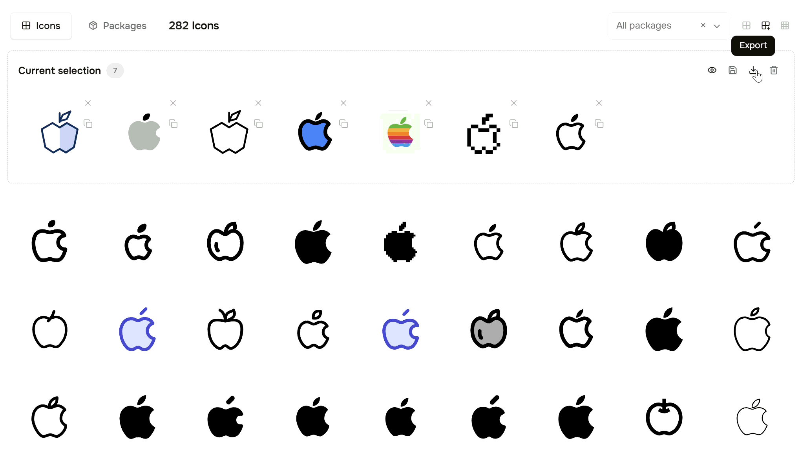

# copy-to-figma

Copy color palettes, type scales, icon grids and full styleguides **into Figma as editable frames** — through the plain clipboard. No Figma plugin, no extension, no account. One button on your site → `⌘V` in Figma.

**▶ [Live demo](https://jinero-online.github.io/copy-to-figma/)** — click "Copy full styleguide", switch to Figma, paste.



Built and battle-tested on [jinero.online](https://jinero.online) (the "Copy to Figma" buttons on the [Design System Generator](https://jinero.online/dev/design-system), [Website Style Extractor](https://jinero.online/dev/style-extractor) and [Icon Library](https://jinero.online/icons/library)).

## How it works

Figma pastes **SVG text from the clipboard as an editable frame**: shapes become vectors, and — the part almost nobody exploits — `<text>` stays *editable text*, laid out in the real font whenever the viewer has it installed. This library generates well-structured SVG "boards" (swatch grids, type scales, icon sheets) designed to survive that import cleanly, and puts them on the clipboard with `navigator.clipboard.writeText()`.

That makes clipboard SVG the only **zero-install** channel into Figma: every alternative (plugins, `.fig` files, token importers) needs the user to install something on the Figma side first.

> **Why not Figma's native clipboard format?** We tried. The internal fig-kiwi payload pastes rectangles perfectly, but text nodes require Figma's pre-computed glyph layout (`derivedTextData`), which Figma will not recompute for pasted payloads — text stays invisible until manually touched. SVG import runs Figma's own text layout, so everything renders on paste.

## Install

```html
<!-- script tag (IIFE, exposes window.CopyToFigma) -->
<script src="https://cdn.jsdelivr.net/gh/jinero-online/copy-to-figma@main/dist/copy-to-figma.iife.js"></script>
```

```js
// or as an ES module
import { copyStyleguideToClipboard } from 'copy-to-figma';
```

## Quick start

```js
const n = await CopyToFigma.copyStyleguideToClipboard({
    colors: [{
        label: 'Brand',
        items: [
            { hex: '#6366F1', label: 'primary' },
            { hex: '#111827', label: 'ink' },
            { hex: '#F9FAFB', label: 'paper' },
        ],
    }],
    typography: [
        { tag: 'H1', family: 'Inter', size: '48px', weight: '700', lineHeight: '1.1', sample: 'Grow the good' },
        { tag: 'Body', family: 'Inter', size: '16px', weight: '400', lineHeight: '1.5', sample: 'The quick brown fox jumps over the lazy dog' },
    ],
    spacing: [{ label: 'sm', px: 8 }, { label: 'md', px: 16 }, { label: 'lg', px: 32 }],
    radius: [4, 8, 16, 9999],
    shadows: ['0 1px 2px rgba(0,0,0,.08), 0 8px 24px rgba(0,0,0,.12)'],
    buttons: [{ text: 'Get started', bgColor: '#6366F1', textColor: '#fff', borderRadius: '9999px', fontSize: '15px', fontWeight: '600', padding: '10px 22px' }],
});
console.log(`${n} items on the clipboard — paste into Figma`);
```

Then switch to Figma and press `⌘V` / `Ctrl+V`. That's it.

## API

Every `build*` function is **pure** (no DOM — runs in Node too) and returns `{ svg, count }`. Every `copy*` helper builds and writes to `navigator.clipboard`, resolving to the item count.

| Function | Input | Board |
|---|---|---|
| `buildColorsSvg(groups)` | `[{ label, items: [{ hex, label }] }]` | labeled swatch-grid sections |
| `buildTypographySvg(styles)` | `[{ tag, family, size, weight, lineHeight, letterSpacing, color, sample }]` | type scale — params left, sample in the real font right |
| `buildFontsSvg(items)` | `[{ family, note }]` | font list, each name set in its own family |
| `buildSpacingSvg(items)` | `[{ label, px }]` | spacing bars |
| `buildRadiusSvg(values)` | `[px, …]` | corner-radius squares |
| `buildShadowsSvg(shadows)` | `['0 2px 8px rgba(…)', …]` | shadow cards (feDropShadow approximation + CSS label) |
| `buildButtonsSvg(buttons)` | `[{ text, bgColor, textColor, borderRadius, fontSize, fontWeight, padding, border }]` | rendered button samples |
| `buildIconsSvg(items)` | `[{ name, svg }]` (raw SVG markup) | icon grid — pasted as editable vectors |
| `buildStyleguideSvg(sections)` | any combination of the above | one composed board |
| `copyColorsToClipboard` / `copyTypographyToClipboard` / `copyIconsToClipboard` / `copyStyleguideToClipboard` | same | build + copy |

## What survives Figma's SVG paste

Knowledge that took real experimentation — the reason this library exists:

| SVG feature | In Figma after paste |
|---|---|
| `<rect>`, `<path>`, `<circle>`, fills, strokes | ✅ editable vectors |
| `<text>` with `font-family` / `size` / `weight` | ✅ **editable text**, real font applied when installed; silent fallback otherwise |
| nested `<svg x y width height viewBox>` | ✅ scaled correctly (how the icon grid works) |
| `currentColor` | ✅ resolves from the root `color` attribute |
| gradients (`linearGradient` / `radialGradient`) | ✅ mostly |
| `<filter>` (drop shadows, blurs) | ⚠️ unreliable — expect them to be dropped; keep a CSS label next to the visual |
| `<foreignObject>`, CSS `<style>` blocks | ❌ avoid |
| auto-layout, components, styles, variables | ❌ out of scope — pasted content is plain frames/vectors/text |

Practical implications baked into the builders:

- **Text is never outlined** — your styleguide's headings stay retypable.
- Icon cells re-embed each icon's own `<svg>` with its original `viewBox`, so mixed-size icon sets align on a grid without touching their paths.
- Shadow cards carry both the visual approximation *and* the CSS string, so nothing is lost even if Figma drops the filter.
- Sample text longer than its card is ellipsized at build time (SVG has no text overflow).

## Caveats

- One-way and intentionally lossy: you get frames + vectors + text, not components or tokens. For token *values*, pair the board with a JSON export (e.g. Tokens Studio format).
- `navigator.clipboard.writeText` needs a secure context (https) and a user gesture.
- Icon SVGs containing `<style>` blocks with colliding class names may bleed into each other on one board; prefer cleaned (SVGO'd) icons.

## License

MIT © [jinero.online](https://jinero.online)
